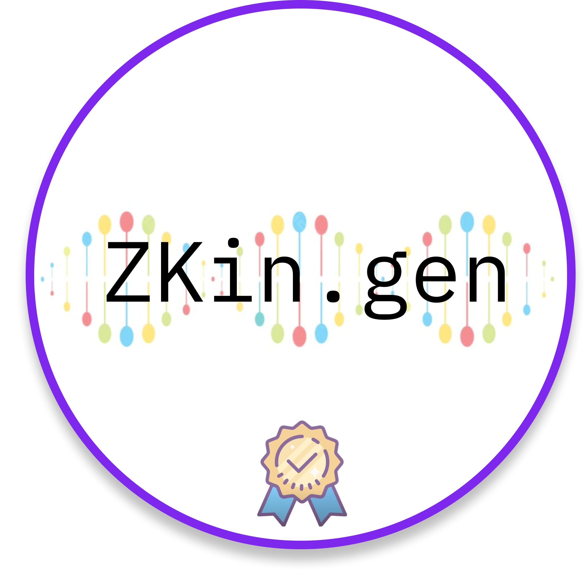
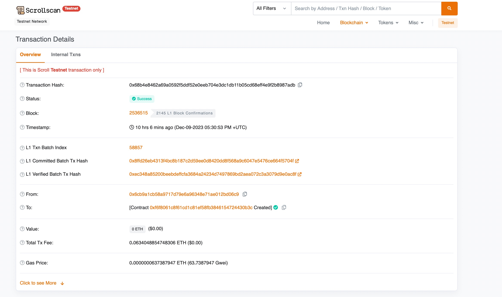

# ZKin.gen

**zkZombies present ZKin.gen - our novel ZK-based decentralised ancestry detection framework**  

> built on ☕ at **#**ETHIndia.
> 

## 💡**The problem ZKin.gen solves**

We present ZKin.gen - our novel ZK based decentralised ancestry detection framework, which is completely onchain -

It is a decentralized upgraded version of 23andMe that leverages blockchain decentralized technologies to address several key problems associated with centralized genetic testing platforms such as

- relinquishing control over their genetic data to a centralized entity as it raises concerns about data ownership and the potential misuse or access to sensitive information.

Our decentralized platform empowers individuals to maintain ownership and control of their genotypic and phenotypic data, which privacy and data autonomy.

- Centralized databases are vulnerable to hacks, jeopardizing sensitive genetic data and raising privacy concerns.

Our Blockchain based app provides secure, tamper-resistant storage with hashed encryption, reducing the risk of unauthorized access or breaches.

- Users lack clarity on how genetic data is used in centralized models, raising concerns about consent and ethical use.

We implement blockchain-based smart contracts with Zero-Knowledge Proofs for transparent, auditable data transactions that ensure computations are verifiable. Users can define ethical terms for data sharing, enhancing transparency.

Additionally, users are notified by using the push protocol when rewards are sent to their specified address, promoting accountability and visibility.

We utlise zero knowledge proofs to inform the consumers about how we obtain their ancestry information from the centralised prover's database.

# 💡 Our Framework

- Used scroll zkEVM for deploying our contract, which extends Ethereum's capability through zero-knowledge proofs tech and EVM compatibility. It reduces the burden on the ethereum main chain, and provides much lower transaction fees and latency!

Contract Address - 0xf6f8061c8f61cd1c81ef58fb3846154724430b3c
Scroll-Etherscan URL - [https://sepolia.scrollscan.dev/address/0xf6f8061c8f61cd1c81ef58fb3846154724430b3c#code](https://sepolia.scrollscan.dev/address/0xf6f8061c8f61cd1c81ef58fb3846154724430b3c#code)

- Used the Zokrates framework for ZK verification and proofs.

# Flow Diagram

# 🧠 Knowledge Primer - Zokrates

- ZoKrates is a toolbox for zkSNARKs on Ethereum. It helps you use verifiable computation in your DApp, from the specification of your program in a high-level language to generating proofs of computation to verifying those proofs in Solidity
- Ethereum runs computations on all nodes of the network, resulting in high costs, limits in complexity, and low privacy. zkSNARKs have been enabled to only verify computations on-chain for a fraction of the cost of running them, but are hard to grasp and work with
- ZoKrates bridges this gap. It helps you create off-chain programs and link them to the Ethereum blockchain, expanding the possibilities for your DApp.

# 📺 Preview

# 💻 Tech Stack

- Scroll zkEVM
- Zokrates
- Node.js
- Javascript/Solidity
- Push Protocol
- Our key idea - Sequence Alignment for obtaining the correlation between Genetic data: dynamic programming over the RNA/DNA Secondary structures. (Used the longest common subsequence (LCS) algorithm as a black-box for the computation)

# System Architecture Diagram

- Let’s assume the flow begins with user, user send their DNA on-chain and to a centralised prover.
- The centralised prover computation gives them the required data after verifying their hash using ZK proofs to give them a reward, and their ancestry data.
- Once the consumers have been rewarded, we notify them using the push protocol.

# ⏭️ What’s next

- Extending this system to more sophisticated systems, and integrating it with Filecoin/IPFS databases.

# Challenges we ran into

- Limited ScrollSepolia ETH, integrating various parts of the project together. We had some challenge initially with setting up the verification of scrollzkevm contract, but were able to figure it out along the way.
- Utilising zero knowledge proofs to inform the consumers about how we obtain their ancestry information from the centralised prover's database, also was a bit of a challenge.

# 📜 License

`ZKin.gen` is available under the MIT license. See the `[LICENSE](Enter%20URL)` file for more info.

# 🤝 Contributing

Please read `[Contributing.md](Enter%20URL)` for details on our code of conduct, and the process for submitting pull requests to us.

# 💥 Contributors

- Kushagra Gupta
- Aditya Anand
- Aditya Raj
- Muskan
- Suraj Choudhary

We are a team of undergraduates from varying disciplines at IITD - It would be our pleasure to connect!

